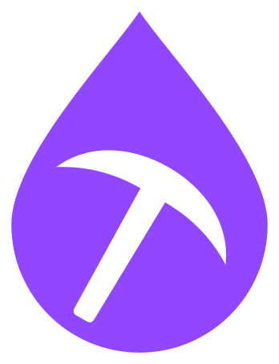

<p align="center">
  
</p>

<h1 align="center">Twitch Drops Miner</h1>

<p align="center">Mine timed Twitch Drops without streaming video or audio.</p>

<p align="center">
  <a href="LICENSE"></a>
</p>

Twitch Drops Miner runs on your own hardware and manages one Twitch account through a
web dashboard. It discovers campaigns, watches eligible live channels through Twitch
watch events, and claims earned rewards. The Rust executable includes the React dashboard.

> [!NOTE]
> This is a hobby project for personal use on your own hardware and home network.
> Support is best effort. VPS, cloud hosting, and services operated for other users are
> outside the support scope; continued compatibility with Twitch is not guaranteed.

## Features

- Automatic discovery of active and upcoming campaigns, with game priorities and channel selection.
- Reward-type filters and drop-name ignore rules that account for prerequisite rewards.
- Live progress with a distinction between Twitch-confirmed values and local estimates.
- Saved Twitch sessions, claimed-drop history, and completed campaigns.
- History filters, statistics, and CSV or JSON export.
- Optional password protection for the dashboard, API, and live connections.
- Docker images for amd64 and arm64, or a standalone executable built from source.

## Quick start

### Docker Compose

> [!NOTE]
> The new image address below is reserved for a future release and is not published yet.
> [Build from a checkout](#build-from-a-checkout) to run the current changes.

Install Docker with Compose support. In a new directory, save this as `compose.yaml`:

```yaml
services:
  twitch-drops-miner:
    image: ghcr.io/ohne-b/twitch-drops-miner:latest
    container_name: twitch-drops-miner
    user: "1000:1000"
    ports:
      - "127.0.0.1:8080:8080"
    volumes:
      - ./data:/app/data
      - ./logs:/app/logs
    restart: unless-stopped
```

Create the `data` and `logs` directories beside that file. On Linux, make them writable
by UID/GID `1000:1000`, which runs the container. Then start it:

```bash
docker compose up -d
```

Open <http://127.0.0.1:8080> and follow [First login](#first-login).
The port mapping limits access to the local machine. For LAN access, bind an explicit
LAN address and enable [dashboard protection](#dashboard-password-and-remote-access).

Future releases will use GitHub Container Registry at `ghcr.io/ohne-b/twitch-drops-miner`.
`latest` follows stable releases; use an explicit version tag to pin a release.
The historical 0.1.0 image remains at `ghcr.io/ohne-b/twitch-miner:0.1.0` for rollback.
Renaming the GitHub repository does not rename that old package or its pull command.
[Release notes](https://github.com/ohne-b/twitch-drops-miner/releases)
and the [changelog](CHANGELOG.md) describe changes between versions.

<a name="build-from-a-checkout"></a>
<details>
<summary>Build the Docker image from a checkout</summary>

The repository's [docker-compose.yml](docker-compose.yml) builds the image locally and
uses the same data paths, user, and loopback port mapping. With Git and Docker installed:

```bash
git clone https://github.com/ohne-b/twitch-drops-miner.git
cd twitch-drops-miner
```

Create writable `data` and `logs` directories as above, then run:

```bash
docker compose up -d --build
```

</details>

### Run from source

Install [Rust through rustup](https://rustup.rs/), Node.js 24, and Git. Windows builds
also require the Visual Studio C++ build tools. The repository pins the Rust toolchain.

```bash
git clone https://github.com/ohne-b/twitch-drops-miner.git
cd twitch-drops-miner
npm --prefix frontend ci
npm --prefix frontend run build
cargo run --locked -- --host 127.0.0.1
```

Open <http://127.0.0.1:8080>. Data and logs go to `data/` and `logs/` relative to the
working directory. After building the frontend, create a release executable with:

```bash
cargo build --release --locked --bin twitch-drops-miner
```

The executable in `target/release/` embeds the dashboard and runs without Node.js.
Use `--help` for host, port, data directory, and log directory options.

## First login

1. Open **Settings > Twitch account** and follow the displayed device-code authorization
   link. Complete authorization on Twitch, then confirm in the dashboard.
2. Link the relevant game accounts through
   [Twitch Drops campaigns](https://www.twitch.tv/drops/campaigns).
3. In **Campaigns**, select **Mine** on a campaign. This selects its game across all
   eligible campaigns. Add more games the same way.
4. Reorder **Settings > Game priorities** and leave the miner running. It selects an
   eligible live channel and claims rewards when Twitch makes them available.

> [!IMPORTANT]
> Only selected games are mined. Discovering a campaign does not select its game, and
> an empty game list sends no watch events. **Stop mining** removes the entire game
> from that list. Already-earned rewards can still be claimed.

Login uses Twitch's Smart TV device authorization flow. The saved session survives
restarts; enter your Twitch password only on Twitch's authorization page.

> [!WARNING]
> Avoid watching Twitch manually with the same account while mining. Simultaneous
> viewing can interfere with drop progress.

## Using the dashboard

**Overview > Channels** shows live streams currently eligible for your selected games and
rewards. Special-event campaigns can include other categories when their actual channel
restriction allows it. Channel changes pause watching until eligibility is refreshed.

Use **Mine channel** to enter a Twitch login or a direct channel URL, including streams
missing from the list. This checks that channel against the current campaign catalog and
adds its eligible game to your mining list. Reward filters, prerequisites and campaign
channel restrictions still apply. Offline channels and channels without eligible known
rewards are reported without changing your selection. Manual selection falls back within
its game if another eligible channel is needed; **Return to Auto Mode** restores game
priority selection. The game stays selected until you remove it.

| Page                     | What it shows                                                                             |
| ------------------------ | ----------------------------------------------------------------------------------------- |
| **Overview**             | Mining progress, live channels, and the **Up next** reward queue.                         |
| **Campaigns**            | Available campaigns, eligibility, filters, and **Mine / Stop mining** controls.           |
| **Campaigns > Finished** | Completed campaigns retained across restarts and refreshes.                               |
| **History**              | Recorded claims, game/date filters, statistics, and exports.                              |
| **Activity**             | Mining messages and errors.                                                               |
| **Settings**             | Twitch login, game priorities, mining preferences, connection, password, and maintenance. |

### Games, filters, and ignored rewards

In **Game priorities**, drag games into order or focus a drag handle and use the arrow
keys. The first game has the highest priority. Settings save silently; if a save
fails or another browser changes the same settings, your edits stay available for **Retry**.

Campaign status filters combine **Active**, **Upcoming**, and **Expired**; **Not linked**
narrows the result to campaigns known to need account linking. Active campaigns with
existing progress appear first. **Finished** requires all watch rewards to be claimed;
expiry alone does not count as completion. Older history without completion evidence
appears separately as **Older recorded rewards**.

**Ignored Drop Keywords** accepts one literal substring per line, matched without regard
to case. Blank lines and duplicates are removed. A matching reward and dependent branches
are ignored, while prerequisites shared with an allowed reward remain mineable. Ignored
or skipped rewards are never treated as claimed. Twitch may still advance an ignored
reward alongside another reward.

Zero-minute subscription rewards are omitted from **Campaigns** and **Up next** because
watching cannot earn them. Expired rewards leave **Up next**; upcoming and sequential
watch rewards remain visible.

**Special Events** and **IRL** can use listed participating channels in other categories
when the campaign has an enabled, nonempty channel list. Select the campaign's game and
keep its rewards eligible. Other campaigns require a matching category and drops-enabled
channel; every watched channel must be live.

### History and saved data

**History** filters by game and a starting date at midnight UTC. Claim times display in
your browser's timezone. CSV and JSON exports contain the filtered results.
**Clear local history** removes the local claim list; Twitch claims and completed
campaign snapshots in **Finished** are kept.

Docker stores application data in `/app/data` and logs in `/app/logs`, mounted to the
directories in the Compose example. Settings, Twitch credentials, dashboard sessions,
claim history, and interrupted-claim recovery records live in the data directory.
Run only one miner per data directory and keep it private.

**Settings > Maintenance > Clear All Cache** discards derived campaign/channel state
and refreshes from Twitch. It preserves settings, credentials, claim history, and
completed campaigns. See [persistent data and migration](docs/operations.md#persistent-data)
for filenames, compatibility, and recovery details.

## Dashboard password and remote access

Password protection is off by default. In **Settings > Dashboard password**, enter and
confirm a password, then enable protection. It protects the dashboard, application API,
and live connections. Mining continues while the dashboard is locked.

- The dashboard password is separate from your Twitch login; no username is needed.
- Sessions last up to 30 days. **Remember me** also persists the browser cookie for that period.
- Changing the password signs out other sessions. Disabling protection requires the
  current password and clears all dashboard sessions.
- Logging out of the dashboard does not log the miner out of Twitch.

> [!IMPORTANT]
> Enable protection on a trusted network before making the dashboard remotely reachable.
> Use HTTPS through a reverse proxy to protect passwords and cookies in transit.

Set `PUBLIC_BASE_URL` to the exact root URL opened in the browser. Add this under the
Compose service, replacing the example hostname:

```yaml
environment:
  PUBLIC_BASE_URL: https://drops.example.com
```

Recreate the container with `docker compose up -d` after changing its environment.
The setting controls the permitted browser origin and enables Secure cookies for HTTPS.
It does not provide TLS, support subpaths, or trust forwarded client-IP headers. Use
one HTTP(S) root URL without credentials, a query, or a fragment. A reverse proxy must
forward both HTTP and Socket.IO connections.

See [dashboard protection](docs/operations.md#dashboard-protection) for session storage
and forgotten-password recovery.

## Updating

The repository and executable are now `twitch-drops-miner`; the dashboard is **Drops Miner**.
Existing data, login, settings and history need no migration for this rename. Keep the existing Compose service
and container name (`twitch-drops-miner`), mounts and project directory when upgrading.
The executable is now `twitch-drops-miner`; update custom service commands if you run it directly.
Existing source checkouts can update their remote with:

```bash
git remote set-url origin https://github.com/ohne-b/twitch-drops-miner.git
```

**Settings > Maintenance** checks the latest stable release and links to its notes.
Installation is manual. A failed update check is reported separately from an up-to-date
installation.

> [!CAUTION]
> Save a copy of the current Compose file before editing it or pulling source changes.
> Stop the miner before backing up its entire data directory. Keep the previous image
> and configuration for rollback.

For the published-image Compose example, update `image:` first if it pins a version tag.
Pull the image before stopping the current container:

```bash
docker compose pull
docker compose stop
```

Back up `data/`, then start the replacement:

```bash
docker compose up -d
```

For a checkout using the repository's Compose file, back up `docker-compose.yml` before
pulling changes. Build while the old container runs:

```bash
git pull --ff-only
docker compose build
docker compose stop
```

Back up `data/`, then recreate the container:

```bash
docker compose up -d --force-recreate
```

Preserve mounts, ownership, and the port binding. Restarting a container alone does not
install a new image. After replacement, inspect `docker compose ps` and
`docker compose logs --tail=100`, then check the dashboard.

When migrating from the Python version, existing settings, history, completed campaigns,
and dashboard protection remain compatible. One fresh Twitch device-code login is
required; old credential files stay untouched for rollback. See
[operations and upgrades](docs/operations.md) for migration details, including earlier
development builds labeled `1.3.2`.

## Troubleshooting

- **No campaigns appear:** clear the campaign filters and check **Activity**. Twitch can
  return an incomplete catalog; live-channel discovery may improve coverage but cannot
  guarantee every campaign appears. Clearing cache or logging in again cannot repair
  an upstream catalog restriction.
- **Mining is idle:** select a game, check account linking, campaign dates, prerequisites,
  reward filters, and ignore rules. Progress requires an eligible live channel.
- **Progress seems stuck:** compare Twitch's inventory with the dashboard's confirmed
  values and local estimates, and stop simultaneous manual viewing. A healthy process
  or **Dashboard connected** status does not prove Twitch is awarding progress.
- **The container cannot write data or logs:** check that the mounted directories are
  writable by UID/GID `1000:1000` and that another miner is not using the same data directory.
- **Writes or live updates fail behind a proxy:** open the configured `PUBLIC_BASE_URL`
  exactly, check the proxy's Socket.IO support, and review the
  [protection configuration](docs/operations.md#dashboard-protection).

## Contributing

Read [CONTRIBUTING.md](CONTRIBUTING.md) for issue reporting, development, required tests,
and independent review. [AGENTS.md](AGENTS.md) contains the repository's agent instructions.
Backend tests use temporary storage and mock transports; browser tests start their own
offline fixture. Never use a live miner or real credentials for automated checks.

Report reproducible problems through [GitHub issues](https://github.com/ohne-b/twitch-drops-miner/issues).
Include the version, installation method, and redacted evidence; never upload credentials,
device codes, or a data directory.

## License and credits

[MIT](LICENSE), copyright 2026 ohne-b (OhneB).

Based on [rangermix/TwitchDropsMiner](https://github.com/rangermix/TwitchDropsMiner),
which builds on [DevilXD/TwitchDropsMiner](https://github.com/DevilXD/TwitchDropsMiner),
and their contributors. The full upstream MIT license is preserved in [NOTICE.md](NOTICE.md).
Bundled font and icon notices are in
[frontend/public/assets/licenses](frontend/public/assets/licenses).
