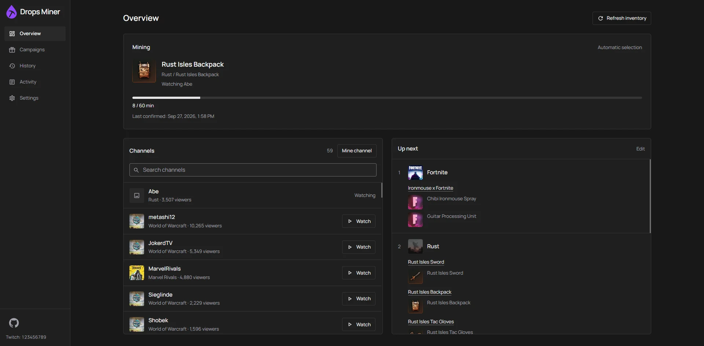

<p align="center">
  
</p>

<h1 align="center">Twitch Drops Miner</h1>

<p align="center">Mine timed Twitch Drops without streaming video or audio.</p>

<p align="center">
  <a href="https://github.com/ohne-b/twitch-drops-miner?tab=License-1-ov-file"></a>
</p>

Twitch Drops Miner runs on your own hardware and manages one Twitch account through a
web dashboard. It discovers campaigns, watches eligible live channels through Twitch
watch events, and claims earned rewards. The Rust executable includes the React dashboard.



> [!NOTE]
> This is a hobby project for personal use on your own hardware and home network.
> Support is best effort. VPS, cloud hosting, and services operated for other users are
> outside the support scope; continued compatibility with Twitch is not guaranteed.

## Features

- Automatic discovery of active and upcoming campaigns, with game priorities and channel selection.
- Reward-type filters and drop-name ignore rules that account for prerequisite rewards.
- Live progress with a distinction between Twitch-confirmed values and local estimates.
- Saved Twitch sessions, claimed-drop history, and completed campaigns.
- History filters, statistics, and CSV or JSON export.
- Optional password protection for the dashboard, API, and live connections.
- Docker images for amd64 and arm64, or a standalone executable built from source.

## Quick start

### Docker Compose

Version 1.0.0 and later use `ghcr.io/ohne-b/twitch-drops-miner`.

Install Docker with Compose support. In a new directory, save this as `compose.yaml`:

```yaml
services:
  twitch-drops-miner:
    image: ghcr.io/ohne-b/twitch-drops-miner:latest
    container_name: twitch-drops-miner
    user: "1000:1000"
    ports:
      - "127.0.0.1:8080:8080"
    volumes:
      - ./data:/app/data
      - ./logs:/app/logs
    restart: unless-stopped
```

Create the `data` and `logs` directories beside that file. On Linux, make them writable
by UID/GID `1000:1000`, which runs the container. Then start it:

```bash
docker compose up -d
```

Open <http://127.0.0.1:8080> and follow [First login](#first-login).
The port mapping limits access to the local machine. For LAN access, bind an explicit
LAN address and enable [dashboard protection](#dashboard-password-and-remote-access).

Release images use GitHub Container Registry at `ghcr.io/ohne-b/twitch-drops-miner`.
`latest` follows stable releases; use an explicit version tag to pin a release.
The historical 0.1.0 image remains at `ghcr.io/ohne-b/twitch-miner:0.1.0` for rollback.
Renaming the GitHub repository does not rename that old package or its pull command.
[Release notes](https://github.com/ohne-b/twitch-drops-miner/releases)
and the [changelog](CHANGELOG.md) describe changes between versions.

<a name="build-from-a-checkout"></a>
<details>
<summary>Build the Docker image from a checkout</summary>

The repository's [docker-compose.yml](docker-compose.yml) builds the image locally and
uses the same data paths, user, and loopback port mapping. With Git and Docker installed:

```bash
git clone https://github.com/ohne-b/twitch-drops-miner.git
cd twitch-drops-miner
```

Create writable `data` and `logs` directories as above, then run:

```bash
docker compose up -d --build
```

</details>

### Run from source

Install [Rust through rustup](https://rustup.rs/), Node.js 24, and Git. Windows builds
also require the Visual Studio C++ build tools. The repository pins the Rust toolchain.

```bash
git clone https://github.com/ohne-b/twitch-drops-miner.git
cd twitch-drops-miner
npm --prefix frontend ci
npm --prefix frontend run build
cargo run --locked -- --host 127.0.0.1
```

Open <http://127.0.0.1:8080>. Data and logs go to `data/` and `logs/` relative to the
working directory. After building the frontend, create a release executable with:

```bash
cargo build --release --locked --bin twitch-drops-miner
```

The executable in `target/release/` embeds the dashboard and runs without Node.js.
Use `--help` for host, port, data directory, and log directory options.

## First login

1. Open **Settings > Twitch account** and follow the displayed device-code authorization
   link. Complete authorization on Twitch, then confirm in the dashboard.
2. Link the relevant game accounts through
   [Twitch Drops campaigns](https://www.twitch.tv/drops/campaigns).
3. In **Campaigns**, select **Mine** on a campaign. This selects its game across all
   eligible campaigns. Add more games the same way.
4. Reorder **Settings > Game priorities** and leave the miner running. It selects an
   eligible live channel and claims rewards when Twitch makes them available.

> [!IMPORTANT]
> Automatic mining watches selected games first. In **Settings > Mining**, opt into
> **Automatically mine reward types** to also mine badges or emotes from other games.
> Both options default off. With an empty game list and both options off, automatic
> watching pauses. Discovery never changes your game list. An explicit **Mine channel** request
> temporarily overrides this list. **Stop mining** removes a game from the automatic
> list. Already-earned rewards can still be claimed.

Automatic reward types target individual watch rewards and their required prerequisite
drops, not every reward in a matching campaign. Other games follow selected games and
use soonest-ending campaign order. Mining benefit filters, ignored names, dates and
channel restrictions still apply; subscription-only rewards are excluded. Campaigns
display filters do not affect these rules. Removing a game from the priority list still
allows matching badges/emotes when their automatic rule is enabled.

Login uses Twitch's Smart TV device authorization flow. The saved session survives
restarts; enter your Twitch password only on Twitch's authorization page.

Campaign discovery uses the [SunkwiBOT public catalog](https://github.com/SunkwiBOT/twitch-drops-api).
It supplies game/reward metadata, dates, prerequisites and participating channels. Account
progress, linkage and claims come from Twitch through your device-code session; Twitch
credentials and identifiers are never sent to the catalog service. Discovery never selects
games automatically. The miner does not query Twitch's gated catalog/detail endpoints or
scan live channels to reconstruct the catalog.

The public feed is a third-party dependency, and its coverage can vary or lag Twitch,
including upcoming or account-specific campaigns. Refresh rejects feed timestamps older
than 30 minutes or over 5 minutes in the future. Failed, stale or malformed responses keep
known active/upcoming campaigns in memory while preserving fresh Twitch inventory. A
restart still needs the feed to rediscover campaigns outside your Twitch inventory.

> [!WARNING]
> Avoid watching Twitch manually with the same account while mining. Simultaneous
> viewing can interfere with drop progress.

## Using the dashboard

**Overview > Channels** shows live streams currently eligible for your selected games and
rewards, plus your manually selected channel. Special-event campaigns can include other
categories when their actual channel restriction allows it. Channel changes pause watching
until fresh stream information is available.

Use **Mine channel** to enter a Twitch login or a direct channel URL, including streams
missing from the list or campaign catalog. A live channel can be watched even when no
reward is discovered; this does not add games to your saved list. Twitch still determines
whether any rewards accrue. Manual mode shows a known reward only after Twitch reports
its progress, and never invents progress for unknown rewards.
The Mine button stays disabled while Twitch checks a channel; lookup errors appear inline.

Optionally enter **Auto mode after** in minutes (1–1440). The timer starts when the channel
is selected and continues through dashboard reconnects and connection renewal. Leave it
blank to watch until **Return to Auto Mode**. If the channel goes offline, manual mode
waits for it to return; the timer continues. Logout, cache clearing or a process restart
also ends manual mode. Automatic selection resumes using your saved games and filters.

**Refresh inventory** in Overview and Maintenance shows its progress in the button. It
stays busy until the refreshed data is published, then briefly shows **Refreshed**, or
**Refresh failed - Retry** with the reason on hover. Repeated requests share the same
refresh; reconnecting the dashboard keeps its current status.
The button keeps its icon aligned on the left as its status changes. Its tooltip also shows
when the public catalog was last updated.

| Page                     | What it shows                                                                             |
| ------------------------ | ----------------------------------------------------------------------------------------- |
| **Overview**             | Mining progress, live channels, and the **Up next** reward queue.                         |
| **Campaigns**            | Available campaigns, eligibility, filters, and **Mine / Stop mining** controls.           |
| **Campaigns > Finished** | Completed campaigns retained across restarts and refreshes.                               |
| **History**              | Recorded claims, game/date filters, statistics, and exports.                              |
| **Activity**             | Mining messages and errors.                                                               |
| **Settings**             | Twitch login, game priorities, mining preferences, connection, password, and maintenance. |

### Games, filters, and ignored rewards

Campaigns shows its filtered count beside the page title. Open **Filters** for
**All games** and **Clear filters**. The sort control offers **Default** (active campaigns
with confirmed progress first), **Newest** (latest campaign start), **Ending Soonest**,
**Most Drops** (total drops), and **A-Z** (campaign name). Sorting stays in the page URL
through searches, tab changes and reloads; it does not change mining priorities.

In **Game priorities**, drag games into order or focus a drag handle and use the arrow
keys. The first game has the highest priority. Settings save silently; if a save
fails or another browser changes the same settings, your edits stay available for **Retry**.

Campaign status filters combine **Active**, **Upcoming**, and **Expired**; **Not linked**
narrows the result to campaigns known to need account linking. Active campaigns with
existing progress appear first. **Finished** requires all watch rewards to be claimed;
expiry alone does not count as completion. Older history without completion evidence
appears separately as **Older recorded rewards**.

The **Mining** card prefers current Twitch-reported reward progress. Confirmed watch
completion releases automatic watching of that reward and prompts inventory reconciliation.
Automatic checks for missing claim evidence are coalesced to at most once per minute,
without pausing watch events. Estimates never prove a claim. Twitch must confirm it before it unlocks prerequisites,
completes a campaign or enters **History**. Reported successor progress can appear while
that claim evidence is still pending.

**Ignored Drop Keywords** accepts one literal substring per line, matched without regard
to case. Blank lines and duplicates are removed. A matching reward and dependent branches
are ignored, while prerequisites shared with an allowed reward remain mineable. Ignored
or skipped rewards are never treated as claimed. Twitch may still advance an ignored
reward alongside another reward.

Zero-minute subscription rewards are omitted from **Campaigns** and **Up next** because
watching cannot earn them. Expired rewards leave **Up next**; upcoming and sequential
watch rewards remain visible.

**Special Events** and **IRL** can use listed participating channels in other categories
when the campaign has an enabled, nonempty channel list. Select the campaign's game and
keep its rewards eligible. Other campaigns require a matching category and drops-enabled
channel; every watched channel must be live.

### History and saved data

**History** includes the miner's claims and imports Twitch-confirmed rewards during
inventory refresh, including badges/emotes and claims made elsewhere. Imports require
matching campaign/drop metadata; rewards no longer available from either inventory or
the catalog cannot be reconstructed. Public catalog entries alone never prove a claim.
Twitch award times are used when available; otherwise **First seen** labels the time
the miner first recorded the confirmed claim. Game/date filters and monthly summaries
use that stored timestamp, displayed in your browser's timezone (date filters start at
midnight UTC). CSV and JSON exports include `claimed_at_is_observed` to identify these
fallback timestamps.
**Clear local history** removes the local claim list and remembers cleared reward IDs
so imports cannot restore them. Twitch claims and completed campaign snapshots in
**Finished** are kept.

Docker stores application data in `/app/data` and logs in `/app/logs`, mounted to the
directories in the Compose example. Settings, Twitch credentials, dashboard sessions,
claim history, and interrupted-claim recovery records live in the data directory.
Run only one miner per data directory and keep it private.

**Settings > Maintenance > Clear All Cache** discards derived campaign/channel state
and refreshes Twitch inventory and the public catalog. It preserves settings, credentials,
claim history, and completed campaigns.

## Dashboard password and remote access

Password protection is off by default. In **Settings > Dashboard password**, enter and
confirm a password, then enable protection. It protects the dashboard, application API,
and live connections. Mining continues while the dashboard is locked.

- The dashboard password is separate from your Twitch login; no username is needed.
- Sessions last up to 30 days. **Remember me** also persists the browser cookie for that period.
- Changing the password signs out other sessions. Disabling protection requires the
  current password and clears all dashboard sessions.
- Logging out of the dashboard does not log the miner out of Twitch.

> [!IMPORTANT]
> Enable protection on a trusted network before making the dashboard remotely reachable.
> Use HTTPS through a reverse proxy to protect passwords and cookies in transit.

Set `PUBLIC_BASE_URL` to the exact root URL opened in the browser. Add this under the
Compose service, replacing the example hostname:

```yaml
environment:
  PUBLIC_BASE_URL: https://drops.example.com
```

Recreate the container with `docker compose up -d` after changing its environment.
The setting controls the permitted browser origin and enables Secure cookies for HTTPS.
It does not provide TLS, support subpaths, or trust forwarded client-IP headers. Use
one HTTP(S) root URL without credentials, a query, or a fragment. A reverse proxy must
forward both HTTP and Socket.IO connections.

If you forget the dashboard password, stop the miner and restrict network access. Back up
and remove only `data/web_auth.json`, restart, then set a new password. Keep all other data.

## Updating

The repository and executable are now `twitch-drops-miner`; the dashboard is **Drops Miner**.
Existing data, login, settings and history need no migration for this rename. Keep the existing Compose service
and container name (`twitch-drops-miner`), mounts and project directory when upgrading.
The executable is now `twitch-drops-miner`; update custom service commands if you run it directly.
Existing source checkouts can update their remote with:

```bash
git remote set-url origin https://github.com/ohne-b/twitch-drops-miner.git
```

**Settings > Maintenance** checks the latest stable release and links to its notes.
Installation is manual. A failed update check is reported separately from an up-to-date
installation.

> [!CAUTION]
> Save a copy of the current Compose file before editing it or pulling source changes.
> Stop the miner before backing up its entire data directory. Keep the previous image
> and configuration for rollback.

For the published-image Compose example, update `image:` first if it pins a version tag.
Pull the image before stopping the current container:

```bash
docker compose pull
docker compose stop
```

Back up `data/`, then start the replacement:

```bash
docker compose up -d
```

For a checkout using the repository's Compose file, back up `docker-compose.yml` before
pulling changes. Build while the old container runs:

```bash
git pull --ff-only
docker compose build
docker compose stop
```

Back up `data/`, then recreate the container:

```bash
docker compose up -d --force-recreate
```

Preserve mounts, ownership, and the port binding. Restarting a container alone does not
install a new image. After replacement, inspect `docker compose ps` and
`docker compose logs --tail=100`, then check the dashboard.

When migrating from the Python version, existing settings, history, completed campaigns,
and dashboard protection remain compatible. One fresh Twitch device-code login is
required; old credential files stay untouched for rollback. Earlier development builds
labeled `1.3.2` need one manual upgrade to join the release series starting at `0.1.0`.

## Troubleshooting

Basic error summaries are written to the server's stderr (Docker logs) and the rotating
`logs/TDM.*.log` files, not the dashboard's Activity page. For a recent failure:

```bash
docker compose logs --since=30m --tail=200 twitch-drops-miner
```

Normal logs identify operations, HTTP status/retry attempts, JSON syntax positions,
rejected field types and catalog problems. Unknown GraphQL messages are fingerprinted.

Idle HTTP connections expire after 15 seconds, before the next 59-second watch event.
Transient watch connection errors, HTTP 429 and HTTP 5xx responses use up to five attempts,
starting with a one-second retry delay and increasing to two, four and eight seconds.
HTTP `Retry-After` is respected within a 1–60 second bound. Retries reuse the same watch
payload and remain cancellable; they never add local progress or replay a successful HTTP 204.
After retries are exhausted, failed watch requests discard their cached beacon address.
After three consecutive failed watch operations for the current stream, the miner renews its Twitch connections
automatically, preserving settings and any manual channel timer. Changing **Connection
Quality** also rebuilds connections and changes timeouts; it is no longer necessary to
toggle it just to trigger recovery from repeated watch failures. This does not bypass
an unavailable Twitch endpoint or guarantee that Twitch credits watch time.

HTTP 401/403 responses from public Twitch pages or settings scripts enter watch recovery
without discarding your saved login. Authentication failures from Twitch's authenticated
API still require reauthorization. After 15 unconfirmed estimates, a successful inventory
refresh clears the stale estimate limit, including for campaigns retained during a partial
refresh. Confirmed progress is preserved; failed refreshes do not reset the limit.

**Advanced diagnostics are off by default**, including with `-v`/`-vv`. To enable them,
add this entry under the miner service's **existing** `environment` section in Compose:

```yaml
  TDM_DIAGNOSTICS: "true"
```

Keep the other environment entries, mounts and ports. Recreate only the miner with
`docker compose up -d --no-deps twitch-drops-miner`. For a standalone executable, use
`--diagnostics` or `TDM_DIAGNOSTICS=true`. Startup logs confirm when the mode is enabled.
Set the variable to `"false"` (or remove it) and recreate the container to switch it off.
This is a server setting; it adds no dashboard controls or Activity messages.

Advanced logs add a request correlation ID, endpoint category, method, status, elapsed
time, HTTP version, selected response headers, body size/fingerprint, and redacted JSON
response previews, including unfamiliar Twitch error messages and successful responses
that the application may subsequently reject. Transport failures include nested error
causes, even when no HTTP response was received. Retry-response capture has a one-second
budget and cannot replace the retry decision.

Captures remove known request/proxy/cookie credentials, sensitive JSON fields, URLs,
credential-bearing text and opaque token-like strings. They are **not exact raw dumps**:
JSON previews are capped at 16 KiB, 256 nodes, 12 levels, 32 array entries, 64 object fields
and 1 KiB per string, with omissions marked. Input strings larger than 16 KiB are withheld
whole to bound redaction work without exposing partial credentials. Non-JSON bodies are
withheld because their credentials cannot be identified structurally; size/fingerprint and available parser
errors remain. Credential-inventory overflow also withholds the preview. Transport
chains are limited to 12 causes and 1 KiB per cause. WebSocket frames are never captured.

Enable this only while reproducing a problem: it logs additional HTTP traffic and can
include account/campaign metadata, so review logs before sharing them. Existing file
rotation retains at most five daily files; Docker retention depends on Compose.
Diagnostics cannot recover earlier failures or prove that Twitch awarded watch time.

- **No campaigns appear:** clear the campaign filters and check **Activity**. The public
  catalog can be unavailable, stale or incomplete; **Refresh inventory** reports a failed
  or partial refresh in its button. Previously known active campaigns stay available during
  a partial refresh, and manual watching still works. Reauthorizing Twitch or clearing cache
  cannot repair a catalog-service outage or add campaigns missing from its feed.
- **Mining is idle:** select a game, check account linking, campaign dates, prerequisites,
  reward filters, and ignore rules. Progress requires an eligible live channel.
- **Progress seems stuck:** compare Twitch's inventory with the dashboard's confirmed
  values and local estimates, and stop simultaneous manual viewing. A healthy process
  or **Dashboard connected** status does not prove Twitch is awarding progress.
- **The container cannot write data or logs:** check that the mounted directories are
  writable by UID/GID `1000:1000` and that another miner is not using the same data directory.
- **Writes or live updates fail behind a proxy:** open the configured `PUBLIC_BASE_URL`
  exactly, check the proxy's Socket.IO support, and review the
  [protection configuration](#dashboard-password-and-remote-access).

## Contributing

Read [CONTRIBUTING.md](CONTRIBUTING.md) for issue reporting, development, required tests,
and independent review. [AGENTS.md](AGENTS.md) contains the repository's agent instructions.
Backend tests use temporary storage and mock transports; browser tests start their own
offline fixture. Never use a live miner or real credentials for automated checks.

Report reproducible problems through [GitHub issues](https://github.com/ohne-b/twitch-drops-miner/issues).
Include the version, installation method, and redacted evidence; never upload credentials,
device codes, or a data directory.

## License and credits

[PolyForm Strict 1.0.0](https://github.com/ohne-b/twitch-drops-miner?tab=License-1-ov-file), copyright 2026 ohne-b (OhneB).
This is source-available software for noncommercial use. The license does not grant
permission to modify or redistribute the software; those uses need separate permission.
Previously published copies retain their original license terms. Third-party components
retain their own licenses.

Based on [rangermix/TwitchDropsMiner](https://github.com/rangermix/TwitchDropsMiner),
which builds on [DevilXD/TwitchDropsMiner](https://github.com/DevilXD/TwitchDropsMiner),
and their contributors. The full upstream MIT license is preserved in [NOTICE.md](NOTICE.md).
Bundled font and icon notices are in
[frontend/public/assets/licenses](frontend/public/assets/licenses).
