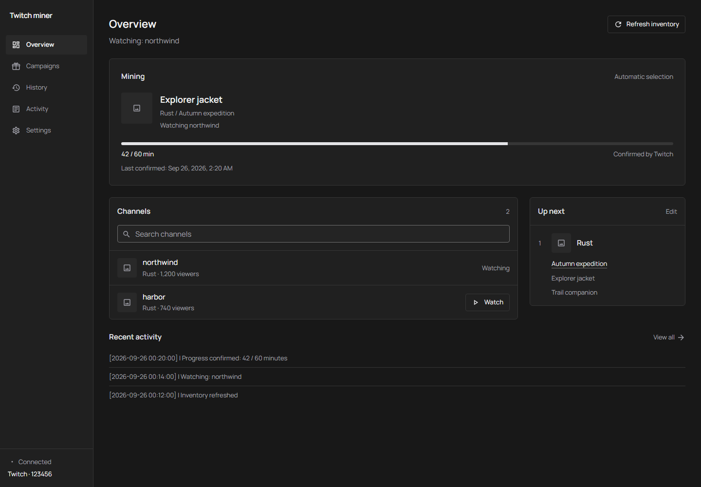

# Twitch Drops Miner

The desktop sidebar shows your signed-in Twitch account ID and a 24px GitHub link.
Overview gives Channels and Up next equal width on desktop, stacking them on smaller screens.
Mining progress keeps the latest confirmed minutes and timestamp without an extra confirmation label.
History saves reward thumbnails with new claims. Older entries use available campaign
artwork, or a placeholder when the original image is unavailable.

Settings → Twitch account provides **Log out of Twitch**. It stops account work and
forgets the server's saved Twitch login, then offers a fresh authorization code.
Dashboard password access, mining preferences and claimed history are retained.

Twitch login uses the authorization code shown inside Settings. Browser session
imports and Chromium renewal helpers are no longer used or required.
"Dashboard connected" reports the connection to your server; the separate Twitch
status and authorization code show whether your account is signed in.

When Twitch withholds its normal catalog or campaign details, discovery reads campaign
metadata from Twitch's participating live channels using the same device login. It
samples three Drops-enabled streams in each of 500 categories, plus up to 100 known or
saved games, on inventory refresh. A scan has a 60-second limit. There is no browser
helper or third-party catalog dependency.

Your account inventory always takes precedence. Recovered campaigns retain their
timing, prerequisites and channel restrictions, and are watched only on channels that
advertised them. Account linkage stays unknown unless Twitch returns it; progress and
claims still come from Twitch. The dashboard reports channel discovery as partial:
campaigns without a sampled live channel, including upcoming ones, may be missing.
A valid empty catalog does not trigger fallback. Clearing caches or logging out is
unnecessary for this recovery.
Without a drop-specific claim record, previously awarded rewards only count as claimed
when your account inventory includes every benefit within that drop's active dates.

> Automatically mine timed Twitch Drops without streaming video or audio.

<p align="center">
  <a href="https://github.com/rangermix/TwitchDropsMiner/stargazers"></a>
  <a href="https://github.com/rangermix/TwitchDropsMiner/releases"></a>
  <a href="https://hub.docker.com/r/rangermix/twitch-drops-miner"></a>
  <a href="https://github.com/rangermix/TwitchDropsMiner/blob/main/LICENSE"></a>
  <a href="https://www.python.org/downloads/"></a>
</p>

Twitch Drops Miner is a low-bandwidth, headless application that discovers eligible
campaigns, selects an appropriate live channel, and tracks drop progress from a web
dashboard. It sends Twitch watch events without downloading the stream itself.

> [!IMPORTANT]
> **This is a hobby project for personal use on your own hardware and home network.**
> Support is limited to that setup. VPS, cloud, and other third-party hosting environments,
> as well as services operated for other users, are outside the project's support scope.
> Maintenance and support are provided on a best-effort basis; continued compatibility
> with Twitch is not guaranteed.



This fork keeps the Python miner and replaces the complete dashboard with React, strict
TypeScript, Tailwind CSS, MDI icons, and locally served Manrope. The interface uses neutral
dark surfaces, compact fields, and a thin custom native scrollbar. See the
[architecture plan](./docs/plans/2026-09-26-redesign.md) and
[design specification](./docs/plans/2026-09-26-design-spec.md).

## Features

- **Low-bandwidth mining** — progresses timed drops without downloading video or audio
- **Automatic campaign discovery** — detects active and upcoming drop campaigns
- **Smart channel selection** — prioritizes eligible channels, preferred games, and viewers
- **Drop-name ignore rules** — excludes unwanted reward names and dependent branches
- **Persistent sessions** — saves OAuth login state between runs
- **Web dashboard** — manages campaigns, channels, inventory, settings, and login status
- **Optional dashboard password** — protects the web UI, API, and live connections with one password
- **Drop history** — records every claimed drop locally (date, game, campaign, rewards)
  with a filterable **History** tab, aggregated stats, and one-click **Export CSV**
- **Headless deployment** — runs on your own home hardware, including Docker, without a desktop GUI
- **Safe rendering** — React text rendering and validated external links; no injected HTML

## Quick start

### Docker (recommended)

Build this fork from source to get the redesigned dashboard. The upstream prebuilt image
contains its own interface. From this checkout:

```bash
docker compose up -d --build
```

Open <http://localhost:8080>. The multi-stage build compiles the dashboard and copies it
into the Python image. Node is only needed during build. The existing data and log mounts
stay compatible; there is no account or database migration. Keep your previous image and
back up persistent data before a future deployment. This source rewrite does not deploy itself.

### From source

Source installations require Python 3.12+, [uv](https://docs.astral.sh/uv/), and Node.js 24.
From the repository root:

```bash
uv venv env --python 3.12
source env/bin/activate
uv sync --active --locked --python 3.12
cd frontend
npm ci
npm run build
cd ..
python main.py
```

On Windows, activate `env\Scripts\Activate.ps1` instead; if PowerShell blocks npm's
script launcher, use `npm.cmd`. Build before starting Python, then open
<http://localhost:8080>. Rebuild after changing frontend code or bundled English strings.
`web/` is generated and ignored by Git; do not edit it directly.

For frontend development, start Python in one terminal and run `npm run dev` in
`frontend/` in another. Vite serves the UI at <http://localhost:5173> and proxies HTTP
and Socket.IO to Python on port 8080. Leave `PUBLIC_BASE_URL` unset for this local setup.
Use the compiled build for deployment.

## Using the web app

Offline channels can have an unknown viewer count, displayed as a dash in Overview.

1. Log in with your Twitch account through the OAuth device flow.
2. Wait for the miner to discover available campaigns.
3. All discovered games are included automatically; choose their priority. You can also search for a game, select
   **Add Game**, and the miner saves the priority automatically.
4. Leave the miner running while it selects eligible channels and tracks drop progress.

Twitch login uses the Smart TV device authorization flow. This fixes the
`KeyError: 'device_code'` startup failure caused by Twitch rejecting the Android app
client. After upgrading from 1.3.0 or earlier, you may need to authorize the miner
once more at `twitch.tv/activate`; the new session is saved for later runs. Channel
pages still use the public Twitch website to discover the watch-event endpoint.

In **Settings → Mining**, game artwork replaces numeric priority fields. Drag the subtle six-dot handle to reorder. Keyboard users can focus the handle and
press the up/down arrow keys. The first game has the highest priority; changes save automatically.

**Special Events** and **IRL** campaigns can be mined on their listed participating
channels even when those channels stream another category or lack a drops-enabled flag.
These categories are included automatically. Channels must be live and eligible;
campaigns without an enabled participating-channel list still require a matching category.
Channels streaming categories outside Games to Watch retain the lowest automatic priority.
When the watched channel goes offline or becomes ineligible, another eligible participant
can replace it even at that same fallback priority.

Inventory filters combine **Active**, **Upcoming**, and **Expired** as alternatives.
**Not Linked** narrows that status result, while fully claimed campaigns stay hidden
until **Finished** is selected. Zero-minute subscription rewards are omitted from the
Inventory and Wanted Drops Queue because they cannot be earned by watching. Individually
expired and non-mineable rewards are also omitted from the queue, while upcoming and
sequential rewards remain visible; successful claims refresh the queue immediately. The
channel list matches game names case-insensitively and keeps the actively watched channel
visible while game settings are changing. Campaign totals and claim messages count only
rewards that can be earned by watching. Consecutive identical no-active-campaign console
prompts are collapsed until another console message appears.

**Ignored Drop Keywords** in Settings is empty by default. Enter one literal substring per
line; surrounding whitespace and blank lines are removed, and duplicates are collapsed
case-insensitively while preserving the first spelling. Matching is also case-insensitive.
A matching drop and every unclaimed branch that depends on it are ignored dynamically.
Prerequisite-only branches with no remaining mineable reward are shown as skipped, while a
prerequisite shared by an allowed reward remains mineable. Ignored and skipped drops are
never reported as claimed. This controls what the miner intentionally targets, but Twitch
may still grant simultaneous progress to an ignored reward while another reward advances.

In **Settings**, **Clear All Cache** calls `POST /api/cache/clear` to discard local
campaign, channel, and other derived miner state while preserving your OAuth login and
settings, then reloads the data from Twitch. This is a recovery and diagnostic action;
it cannot correct inaccurate campaign metadata returned by Twitch.

### Dashboard password

Password protection is **off by default**. In **Settings → Dashboard password**, enter
and confirm a password (8–1024 characters), then select **Enable password protection**.
This password is separate from your Twitch account; no username is needed. Enabling it
immediately locks out other browsers. Mining continues while the dashboard is locked.

If the login page shows a temporary request error, you can still enter your password
and select **Log in** to retry without reloading the page.

- Login uses an HttpOnly, SameSite=Strict **session cookie** by default. Select
  **Remember me for 30 days** for a persistent cookie with a fixed 30-day expiry.
  Sessions survive miner restarts, and all sessions have a maximum server lifetime of
  30 days. Browser session-restore features may preserve session cookies; use **Log out**
  to explicitly revoke a session on shared devices.
- **Change password** requires the current password and signs out all other sessions.
  The browser making the change receives a new session cookie.
- **Disable protection and clear password** also requires the current password. It
  deletes the stored password hash and all sessions, making the dashboard public again.
- Passwords are salted and hashed with scrypt; only digests of random session tokens
  are stored. Login and password-setting attempts are rate limited (5 per minute per
  client IP, 30 per minute overall). Auth credentials never enter normal settings or logs.
- The UI, application API, and Socket.IO are protected. `/healthz` stays public and
  returns only a health flag for Docker checks. Login resources and auth status are public.
  API writes require `X-TDM-Request: 1`; browser clients send it automatically. Cross-origin
  writes and Socket.IO connections are rejected.

**Remote access to your home-hosted instance:** use HTTPS through a reverse proxy to encrypt passwords and cookies.
Set the miner's `PUBLIC_BASE_URL` environment variable to the exact address you open in
your browser, for example `PUBLIC_BASE_URL=https://drops.example.com`. The included
Compose file has a commented example; uncomment it, replace the hostname, and recreate
the container with `docker compose up -d --build` after updating the source.

The setting accepts one absolute `http://` or `https://` root URL with an optional port
and trailing slash. Credentials, subpaths, query strings, fragments, wildcard hosts, and
multiple URLs are rejected at startup. Use a hostname, dotted-decimal IPv4 address, or
bracketed IPv6 address; legacy short/octal/hexadecimal IPv4 forms are rejected. The setting
controls the allowed origin for API writes and Socket.IO connections. HTTPS public URLs
give session cookies the Secure flag even
when the proxy connects to the miner over HTTP or rewrites Host. Continue opening the
dashboard at that configured URL; browser writes/connections from another address are
rejected. It does not provide TLS or add support for hosting under a subpath.

Leaving `PUBLIC_BASE_URL` unset or empty keeps request-derived origin and cookie behavior.
For that setup, preserve the original Host header and configure Uvicorn to trust forwarded
protocol/IP headers **only from your proxy**, for example with `FORWARDED_ALLOW_IPS` set to
its exact IP or dedicated proxy subnet. Do not use `*` as a default. `PUBLIC_BASE_URL` does
not trust forwarded headers or restore client IPs: a proxy that hides them shares the
per-IP login limit unless client-IP forwarding is separately configured with trusted peers.
Keep `X-TDM-Request: 1` on API writes; Socket.IO does not require that marker.
Configure protection on a trusted network before making the dashboard publicly reachable.
Run one miner process per data directory.

**Forgotten password:** stop the miner, restrict network access to its port, delete only
`data/web_auth.json` (Docker: `/app/data/web_auth.json` in the mounted data directory),
then restart and set a new password in Settings before restoring remote access. This
resets dashboard authentication without deleting Twitch cookies or other settings.
Keep the data directory private. A malformed auth file stops startup rather than silently
turning off protection. **Clear All Cache** preserves dashboard authentication.

### Drop history

The **History** tab logs every successfully claimed drop to `data/drop_history.json`.
Filter the table by game name or "claimed on or after" date, view per-game and per-month
stats, or download the current view as a CSV file (UTF-8 BOM so Excel opens it cleanly).
The interface uses English. The date filter starts at
midnight UTC on the selected date; displayed claim times use your browser’s local timezone.
CSV downloads support Unicode game names. Existing Twitch claims are not backfilled.
**Clear local history** requires confirmation and deletes local history; this does not affect your
Twitch account or already-claimed rewards.

> [!NOTE]
> Unlinked game accounts are included in mining. Twitch may require linking before
> a reward can be delivered. Check the campaign’s account-link requirement.

## Important notes

> [!WARNING]
> Avoid watching Twitch manually with the same account while the miner is running.
> Simultaneous viewing can cause drop-progress desynchronization.

- Docker data is stored inside the container at `/app/data`; the examples persist it
  to `./data` on the host.
- Source installations store persistent data in the repository's `data/` directory.
- Logs can be persisted separately by mounting `./logs:/app/logs`.

## Contributing

Use descriptive `feat/` or `fix/` branches and merge changes through a pull request.
See [CONTRIBUTING.md](./CONTRIBUTING.md) for issue reporting, development setup,
pull requests, required unit and regression checks, and independent adversarial review.
Coding agents must follow the mandatory workflow in [AGENTS.md](./AGENTS.md), also
available through the `CLAUDE.md` and `GEMINI.md` symlinks. The pull request template
records validation and review evidence.

Dashboard session-expiry tests use a controlled clock and scheduled callbacks to check
idle socket disconnection without depending on short wall-clock sleeps.

## Contributors

Contributors are credited automatically when their pull requests are merged into `main`.

<!-- contributors:start -->
| Contributor | Merged pull requests |
| --- | --- |
| [@3lb0z0](https://github.com/3lb0z0) | [#110](https://github.com/rangermix/TwitchDropsMiner/pull/110) |
| [@birdhimself](https://github.com/birdhimself) | [#41](https://github.com/rangermix/TwitchDropsMiner/pull/41) |
| [@capkz](https://github.com/capkz) | [#70](https://github.com/rangermix/TwitchDropsMiner/pull/70) |
| [@EthanBlazkowicz](https://github.com/EthanBlazkowicz) | [#33](https://github.com/rangermix/TwitchDropsMiner/pull/33) |
| [@Klages](https://github.com/Klages) | [#94](https://github.com/rangermix/TwitchDropsMiner/pull/94) · [#95](https://github.com/rangermix/TwitchDropsMiner/pull/95) |
| [@Knight-sys](https://github.com/Knight-sys) | [#3](https://github.com/rangermix/TwitchDropsMiner/pull/3) |
| [@ohne-b](https://github.com/ohne-b) | [#1](https://github.com/ohne-b/twitch-miner/pull/1) · [#2](https://github.com/ohne-b/twitch-miner/pull/2) · [#3](https://github.com/ohne-b/twitch-miner/pull/3) · [#4](https://github.com/ohne-b/twitch-miner/pull/4) · [#5](https://github.com/ohne-b/twitch-miner/pull/5) |
| [@rangermix](https://github.com/rangermix) | [#1](https://github.com/rangermix/TwitchDropsMiner/pull/1) · [#2](https://github.com/rangermix/TwitchDropsMiner/pull/2) · [#7](https://github.com/rangermix/TwitchDropsMiner/pull/7) · [#8](https://github.com/rangermix/TwitchDropsMiner/pull/8) · [#9](https://github.com/rangermix/TwitchDropsMiner/pull/9) · [#13](https://github.com/rangermix/TwitchDropsMiner/pull/13) · [#20](https://github.com/rangermix/TwitchDropsMiner/pull/20) · [#24](https://github.com/rangermix/TwitchDropsMiner/pull/24) · [#29](https://github.com/rangermix/TwitchDropsMiner/pull/29) · [#32](https://github.com/rangermix/TwitchDropsMiner/pull/32) · [#45](https://github.com/rangermix/TwitchDropsMiner/pull/45) · [#74](https://github.com/rangermix/TwitchDropsMiner/pull/74) · [#79](https://github.com/rangermix/TwitchDropsMiner/pull/79) · [#80](https://github.com/rangermix/TwitchDropsMiner/pull/80) · [#84](https://github.com/rangermix/TwitchDropsMiner/pull/84) · [#86](https://github.com/rangermix/TwitchDropsMiner/pull/86) · [#88](https://github.com/rangermix/TwitchDropsMiner/pull/88) · [#93](https://github.com/rangermix/TwitchDropsMiner/pull/93) · [#89](https://github.com/rangermix/TwitchDropsMiner/pull/89) · [#90](https://github.com/rangermix/TwitchDropsMiner/pull/90) · [#91](https://github.com/rangermix/TwitchDropsMiner/pull/91) · [#92](https://github.com/rangermix/TwitchDropsMiner/pull/92) · [#104](https://github.com/rangermix/TwitchDropsMiner/pull/104) · [#105](https://github.com/rangermix/TwitchDropsMiner/pull/105) · [#116](https://github.com/rangermix/TwitchDropsMiner/pull/116) · [#119](https://github.com/rangermix/TwitchDropsMiner/pull/119) · [#120](https://github.com/rangermix/TwitchDropsMiner/pull/120) |
| [@Sean-Destefano](https://github.com/Sean-Destefano) | [#49](https://github.com/rangermix/TwitchDropsMiner/pull/49) |
| [@SimpliAj](https://github.com/SimpliAj) | [#72](https://github.com/rangermix/TwitchDropsMiner/pull/72) |
| [@Stein-N](https://github.com/Stein-N) | [#71](https://github.com/rangermix/TwitchDropsMiner/pull/71) |
| [@vurmil](https://github.com/vurmil) | [#12](https://github.com/rangermix/TwitchDropsMiner/pull/12) · [#17](https://github.com/rangermix/TwitchDropsMiner/pull/17) · [#18](https://github.com/rangermix/TwitchDropsMiner/pull/18) · [#100](https://github.com/rangermix/TwitchDropsMiner/pull/100) |
<!-- contributors:end -->

## Support

If Twitch Drops Miner saves you time or bandwidth, you can support the project by:

- [starring the repository](https://github.com/rangermix/TwitchDropsMiner)
- [reporting an issue](https://github.com/rangermix/TwitchDropsMiner/issues) or
  [submitting a pull request](https://github.com/rangermix/TwitchDropsMiner/pulls)
- [buying the maintainer a coffee](https://buymeacoffee.com/rangermix)

## Credits

This project is a modern fork of
[DevilXD/TwitchDropsMiner](https://github.com/DevilXD/TwitchDropsMiner), created by
[@DevilXD](https://github.com/DevilXD). You can support the original author through
[Buy Me a Coffee](https://www.buymeacoffee.com/DevilXD) or
[Patreon](https://www.patreon.com/bePatron?u=26937862).

<details>
<summary>Original project and translation credits</summary>

### Original project contributions

- [@guihkx](https://github.com/guihkx) — CI scripts, CI maintenance, and Linux builds
- [@kWAYTV](https://github.com/kWAYTV) — dark mode theme

### Translation credits

- **Arabic** — [@Bamboozul](https://github.com/Bamboozul)
- **Chinese (Simplified)** — [@Suz1e](https://github.com/Suz1e),
  [@wwj010](https://github.com/wwj010), and
  [@zhangminghao1989](https://github.com/zhangminghao1989)
- **Chinese (Traditional)** — [@Ricky103403](https://github.com/Ricky103403) and
  [@LusTerCsI](https://github.com/LusTerCsI)
- **Czech** — [@nwvh](https://github.com/nwvh)
- **Danish** — [@Kjerne](https://github.com/Kjerne)
- **French** — [@roobini-gamer](https://github.com/roobini-gamer) and
  [@Calvineries](https://github.com/Calvineries)
- **German** — [@ThisIsCyreX](https://github.com/ThisIsCyreX)
- **Hungarian** — [@centipederat](https://github.com/centipederat)
- **Indonesian** — [@Eriza-Z](https://github.com/Eriza-Z)
- **Italian** — [@casungo](https://github.com/casungo)
- **Japanese** — [@ShimadaNanaki](https://github.com/ShimadaNanaki)
- **Polish** — [@Patriot99](https://github.com/Patriot99), co-authored with
  [@DevilXD](https://github.com/DevilXD)
- **Portuguese** — [@zarigata](https://github.com/zarigata)
- **Russian** — [@Sergo1217](https://github.com/Sergo1217) and
  [@kilroy98](https://github.com/kilroy98)
- **Spanish** — [@Shofuu](https://github.com/Shofuu)
- **Turkish** — [@alikdb](https://github.com/alikdb)
- **Ukrainian** — [@Nollasko](https://github.com/Nollasko) and
  [@kilroy98](https://github.com/kilroy98)

</details>

## Development disclosure

Repository instructions for all coding agents live in [AGENTS.md](./AGENTS.md).
`CLAUDE.md` and `GEMINI.md` are relative symlinks to that file; edit `AGENTS.md` to
update the shared guidance.

This fork is maintained with AI-assisted development tools. Changes are validated through
automated tests and code-quality checks, but users should still review updates before
deploying them. The validation suite includes GraphQL watch events and batched channel
discovery, alongside settings, English message schema and placeholder checks,
and frontend safety checks. Use the software
responsibly. Release automation verifies that the runtime, package, and lockfile versions
match before publishing tags and Docker images. Docker validation and release jobs use
the same pinned, Node-24-native Buildx and image-build action releases.
The suite also covers ignored-keyword normalization, dependency branches, the combined
expiry/ignore Wanted Queue guard, watch selection, API persistence, English placeholder
parity, frontend rendering, and the claimed-drop history store with CSV export and API
endpoints. Vite generates content-hashed assets with immutable caching; HTML is revalidated.
Source changes no longer need a manual browser cache-key bump. The existing release workflow
still controls application versioning and image publication.

Game priorities support Enter to add an exact or unique partial match. Ambiguous
searches ask for a more specific name. Manual names require confirmation; Escape
cancels and keyboard focus stays in the dialog. All discovered games are included.

## Dashboard development and checks

The frontend source is in `frontend/src`; shared controls, theme tokens, HTTP helpers,
and the Socket.IO state provider serve Overview, Campaigns, History, Activity, Settings,
and Login. Python owns mining, storage, secrets, and access control. The API includes
confirmed minutes/timestamps, unavailable-catalog status, and settings revisions so a
stale browser cannot overwrite a newer save. Proxy credentials are masked in logs.

History shows 25 records per page while preserving full filtered exports. Activity retains
at most 1,000 lines and follows new messages only while the view is at the bottom. Dirty
settings survive reconnects and navigation; saves are serialized while fields stay editable.
A failed or conflicting save keeps the draft and offers Retry. All UI copy is English.

Install development dependencies with `uv sync --active --extra dev --locked --python 3.12`
in the activated environment. Then:

```bash
npm --prefix frontend ci
npm --prefix frontend run format:check
npm --prefix frontend test
npm --prefix frontend run build
python -m ruff check src/
python -m mypy src/
python -m pytest tests/
cd frontend
npx playwright install chromium
npm run test:browser
```

Browser tests use the production build and a separate synthetic FastAPI/Socket.IO server
on port 8765, temporary storage, and mocked services. They refuse to reuse an existing
server and do not contact Twitch. CI also runs accessibility
checks, release-script tests, and Docker builds for amd64 and arm64. See
[CONTRIBUTING.md](./CONTRIBUTING.md) for the full workflow.

The interface and miner messages use English only. Older saved language preferences are ignored.

Field labels and controls stay aligned when only one field has helper text.
Keyboard focus uses subtle control/background changes without a surrounding ring.
Native checkboxes highlight their label, and forced-colors mode retains system focus outlines.

Notification integration has been removed. Obsolete notification credentials are discarded when settings are loaded and saved.

All eligible discovered games are mined, including games absent from the saved priority list. New games follow saved priorities; Select all and Deselect all are unnecessary.
An empty priority list also mines automatically; no initial game selection is needed.

Page headings stand on their own; repeated descriptive and appearance copy has been removed.
Connection status lives under Settings → Twitch account; the sidebar footer links to GitHub.

Settings save automatically after a short pause. Pending edits survive navigation; failed or conflicting saves retain input and offer Retry. Only changed fields are submitted, so other preferences are preserved.
